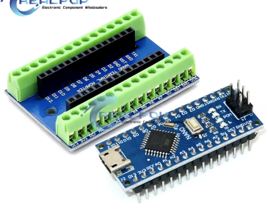
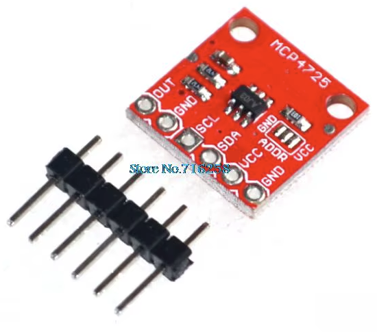
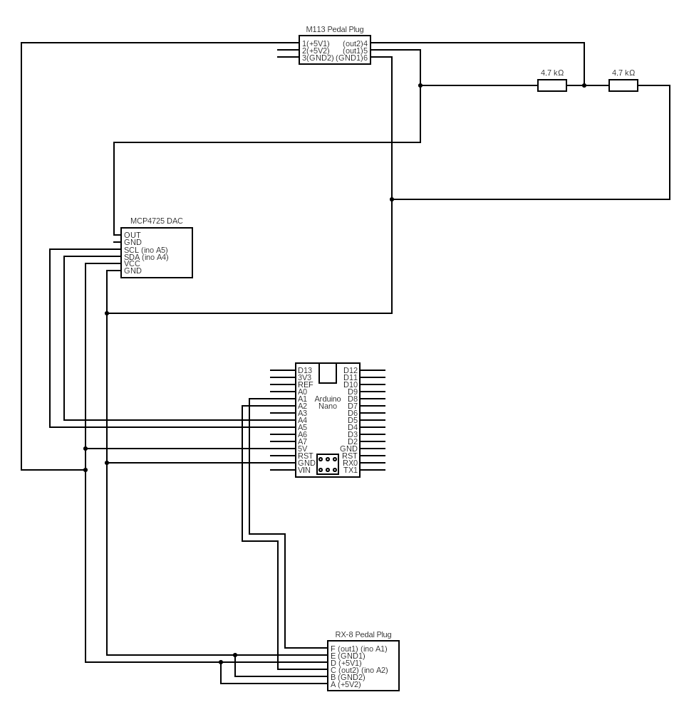
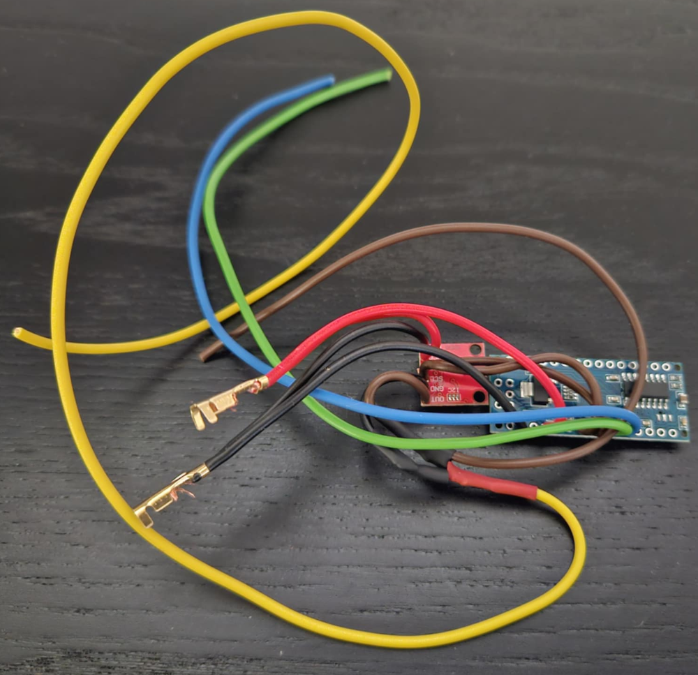
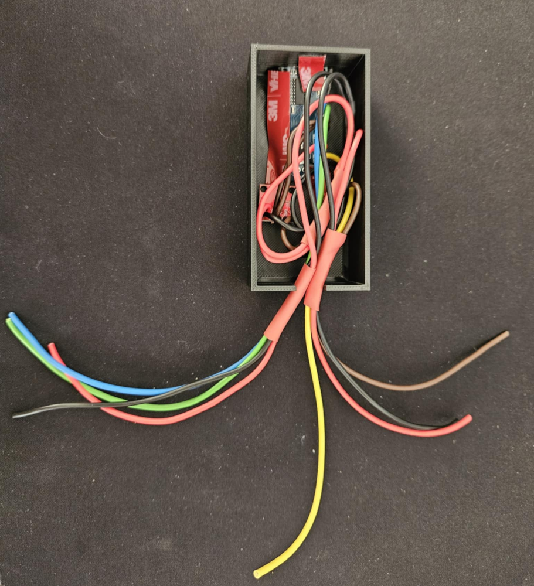
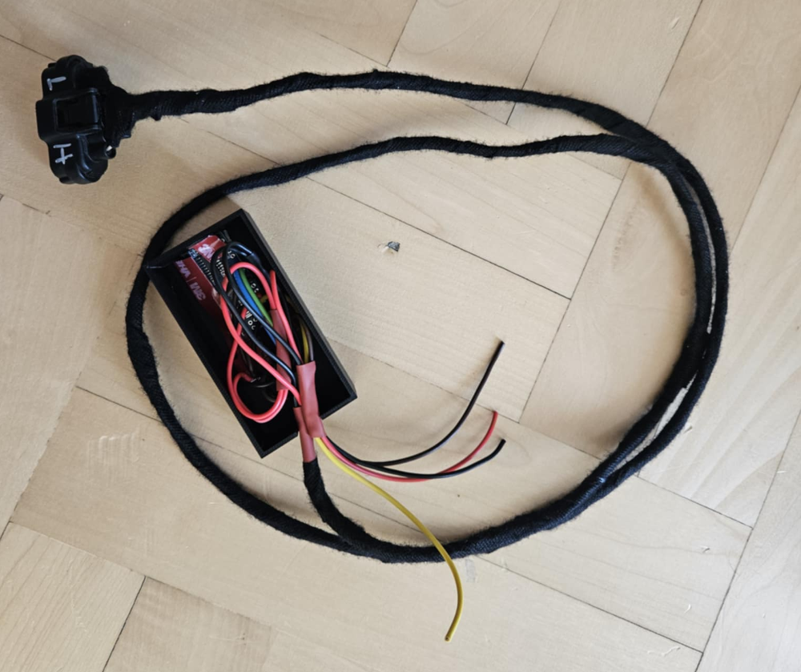

# Mazda RX-8 throttle pedal to M113 ECU adapter

Mazda RX-8 throttle pedal adapter for Mercedes M113 ECU (M113 V8 swap into RX-8).

<!-- TOC -->
* [Mazda RX-8 throttle pedal to M113 ECU adapter](#mazda-rx-8-throttle-pedal-to-m113-ecu-adapter)
  * [OEM Pedals documentation](#oem-pedals-documentation)
  * [Adapter](#adapter)
    * [How it works](#how-it-works)
    * [Basic logic (runs in loop)](#basic-logic-runs-in-loop)
  * [Components](#components)
  * [Circuit diagram](#circuit-diagram)
  * [Assembled adapter](#assembled-adapter)
  * [Arduino IDE setup](#arduino-ide-setup)
  * [Adopting a similar solution for other swaps (different ECUs/pedals)](#adopting-a-similar-solution-for-other-swaps-different-ecuspedals)
<!-- TOC -->

## OEM Pedals documentation

- [RX-8 pedal](./docs/rx-8-pedal/rx-8-pedal.md)
- [M113 pedal](./docs/m113-pedal/m113-pedal.md)

## Adapter

### How it works

Mazda RX-8 pedal has two sensors (potentiometers) that have voltage offset between each other.

M113 pedal has two sensors (potentiometers) that have one sensor being 2*voltage of the other sensor.

Adapter reads the voltage from Mazda pedal, converts it to M113 voltage with DAC (for one sensor) and then takes output
from DAC and divides it by two using a simple resistor-based voltage divider for the other sensor.

### Basic logic (runs in loop)

1. Read voltages from both sensors on RX-8 pedal
2. Calculate percentage from both sensors
3. Validate if percentages are not out of sync (safety feature)
    - if they are, set the throttle limit to 30%
    - if they are not, clear the throttle limit
4. Set output for DAC (for "high" pedal)

## Components

- Arduino Nano   
- MCP4725 DAC   
- RX-8 pedal plug
- two resistors for voltage divider (I choose 4.7 kOhm, but it does not really matter)
- some wires

## Circuit diagram

Circuit was drawn using https://www.circuit-diagram.org/.

Source code for the diagram is located in [circuit cddx file](./docs/circuit.cddx)

## Assembled adapter

## Arduino IDE setup

- Install Adafruit_MCP4725 library
- Load project from `arduino/pedal_adapter/pedal_adapter.ino`

## Adopting a similar solution for other swaps (different ECUs/pedals)

If You have a different swap than M113 You will need to:

- read voltages from the throttle pedal
    - if they have the same logic as for mercedes (one is a multiplication of the other)
        - You need to recalculate DAC values using the script from "utils"
    - if they have different logic (offset, whatever)
        - You need to either:
            - use two DACs (easier but requires small code change)
            - use voltage subtractor (a bit more complex electronic wise, but no code changes required) 
