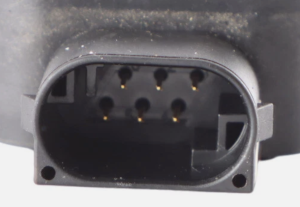

# M113 Throttle pedal

## Pedal plug (pedal side)

## Plug pinout

| pin number | sensor                 | function      |
|------------|------------------------|---------------|
| 1          | main                   | +5V           |
| 2          | secondary              | +5V           |
| 3          | secondary              | GND           |
| 4          | secondary (up to 2.5V) | sensor output |
| 5          | main(up to 5v)         | sensor output |
| 6          | main                   | GND           |

## ECU pinout

## Pedal voltages

### Captured with multimeter

Voltages captured using an external power supply and two multimeters.

This not exactly `high=2*low`, probably due to using second-hand pedal that wasn't ideal.

| high | low  | diff | multiplier       |
|------|------|------|------------------|
| 0.29 | 0.13 | 0.16 | 2.23076923076923 |
| 0.56 | 0.29 | 0.27 | 1.93103448275862 |
| 0.89 | 0.38 | 0.51 | 2.34210526315789 |
| 0.94 | 0.43 | 0.51 | 2.18604651162791 |
| 1.06 | 0.51 | 0.55 | 2.07843137254902 |
| 1.19 | 0.52 | 0.67 | 2.28846153846154 |
| 1.23 | 0.57 | 0.66 | 2.15789473684211 |
| 1.24 | 0.58 | 0.66 | 2.13793103448276 |
| 1.25 | 0.59 | 0.66 | 2.11864406779661 |
| 1.35 | 0.64 | 0.71 | 2.109375         |
| 1.4  | 0.65 | 0.75 | 2.15384615384615 |
| 1.57 | 0.75 | 0.82 | 2.09333333333333 |
| 1.62 | 0.77 | 0.85 | 2.1038961038961  |
| 1.77 | 0.84 | 0.93 | 2.10714285714286 |
| 1.94 | 0.93 | 1.01 | 2.08602150537634 |
| 2.04 | 1    | 1.04 | 2.04             |
| 2.19 | 1.06 | 1.13 | 2.06603773584906 |
| 2.31 | 1.15 | 1.16 | 2.00869565217391 |
| 2.56 | 1.24 | 1.32 | 2.06451612903226 |
| 2.86 | 1.39 | 1.47 | 2.05755395683453 |
| 3.19 | 1.53 | 1.66 | 2.08496732026144 |
| 4.07 | 1.95 | 2.12 | 2.08717948717949 |
| 4.27 | 2.09 | 2.18 | 2.04306220095694 |
| 4.39 | 2.27 | 2.12 | 1.93392070484582 |
| 4.68 | 2.32 | 2.36 | 2.01724137931034 |

### Captured via OBD

Voltages captured using DS150 clone.

This is much closer to `high=2*low`, probably safe to assume it is and take into consideration that pedal in the car was
not new either.

| high | low  | multiplier  |
| ---- | ---- | ----------- |
| 0,33 | 0,19 | 1,736842105 |
| 1,05 | 0,6  | 1,75        |
| 1,38 | 0,69 | 2           |
| 1,6  | 0,8  | 2           |
| 1,85 | 0,93 | 1,989247312 |
| 1,93 | 1,04 | 1,855769231 |
| 1,96 | 0,98 | 2           |
| 2,23 | 1,12 | 1,991071429 |
| 2,3  | 1,15 | 2           |
| 2,36 | 1,18 | 2           |
| 2,56 | 1,28 | 2           |
| 2,65 | 1,33 | 1,992481203 |
| 2,73 | 1,37 | 1,99270073  |
| 2,98 | 1,5  | 1,986666667 |
| 3,24 | 1,63 | 1,987730061 |
| 3,31 | 1,66 | 1,993975904 |
| 3,54 | 1,78 | 1,988764045 |
| 3,55 | 1,78 | 1,994382022 |
| 3,89 | 1,95 | 1,994871795 |
| 3,97 | 1,99 | 1,994974874 |
| 4,06 | 2,3  | 2           |
| 4,31 | 2,16 | 1,99537037  |
| 4,67 | 2,34 | 1,995726496 |

