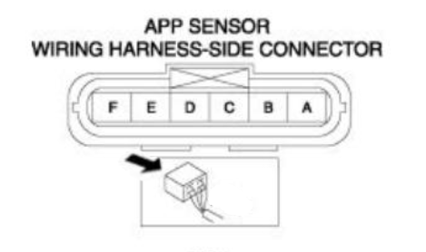
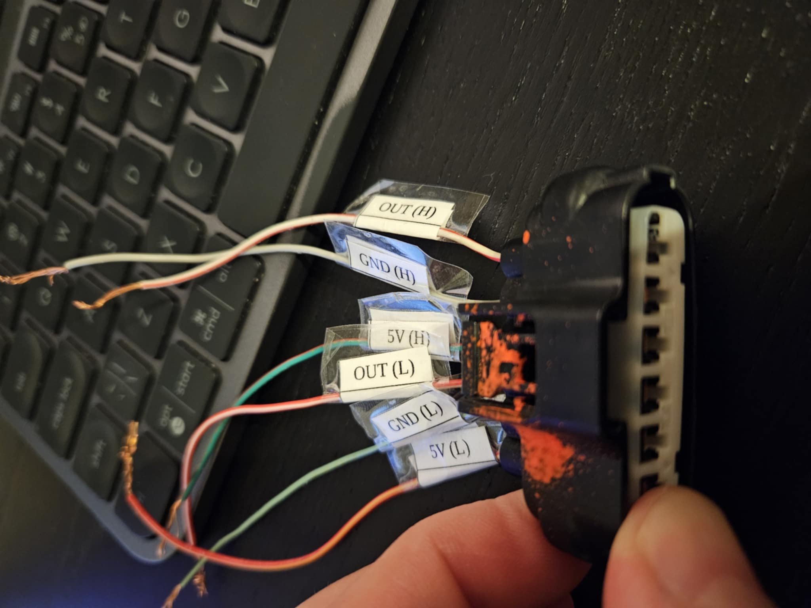

# Mazda RX-8 Throttle pedal

## Pedal plug

Pins are numbered looking from the wiring side (back side of the plug).

## Plug pinout

| pin number | wire color       | sensor          | function      |
|------------|------------------|-----------------|---------------|
| F          | white-red        | main (high)     | sensor output |
| E          | gray             | main            | GND           |
| D          | green-red        | main            | +5V           |
| C          | red-white        | secondary (low) | sensor output |
| B          | lightgreen-black | secondary       | GND           |
| A          | red-yellow       | secondary       | +5V           |

## Pedal voltages

Voltages captured using an external power supply and two multimeters.

| HIGH | LOW  | DIFF |
|------|------|------|
| 1,58 | 1,03 | 0,55 |
| 1,98 | 1,41 | 0,57 |
| 2,11 | 1,54 | 0,57 |
| 2,45 | 1,88 | 0,57 |
| 2,59 | 2,02 | 0,57 |
| 2,6  | 2,03 | 0,57 |
| 2,71 | 2,14 | 0,57 |
| 2,72 | 2,15 | 0,57 |
| 2,79 | 2,24 | 0,55 |
| 2,85 | 2,28 | 0,57 |
| 2,98 | 2,42 | 0,56 |
| 3,19 | 2,62 | 0,57 |
| 3,61 | 3,05 | 0,56 |
| 3,9  | 3,35 | 0,55 |

There is ~0.55 V of difference between two potentiometers in the pedal.

If we assume that we will divide pedal position into 100 steps, then each step will have ~0.02 voltage range.
This should be good enough for Arduino's ADC.
