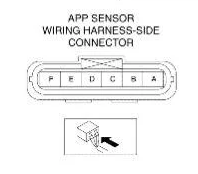

# Mazda RX-8 Throttle pedal

## Pedal plug

## Plug pinout

| pin number | sensor | function |
|--|--|--|
| A | main |  +5V |
| B | main |  GND |
| C | main |  sensor output |
| D | secondary |  +5V |
| E | secondary |  GND |
| F | secondary |  sensor output |
